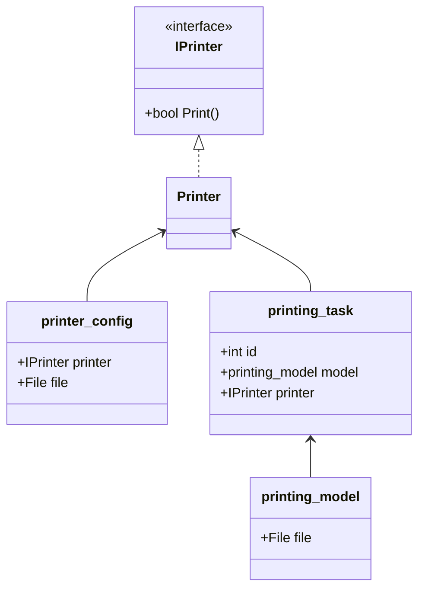

```mermaid
classDiagram
    class IPrinter{
        <<interface>>
        +bool Print()
    }

    class Printer{
    }
    IPrinter <|..  Printer

    class printer_config{
        +IPrinter printer
        +File file
    }
    Printer <-- printer_config 

    class printing_task{
        +int id
        +printing_model model
        +IPrinter printer
    }
    Printer <-- printing_task
    printing_task <-- printing_model
    
    class printing_model{
        +File file
    }
```
